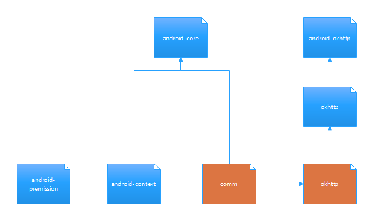

## KUtil

### 项目描述

kotlin 便捷方法合集

[WIKI](https://github.com/yizems/KUtil/wiki)

### 目录

- android: 安卓相关
    - android-core: 安卓主要方法合集, 一般直接引用该类即可
    - android-okhttp: 为安卓上使用okhttp提供的便捷方法
    - android-context: 安卓Context全局获取类
- okhttp: okhttp快捷方法
- comm: 通用快捷方法: 例如集合,时间,文件等等

### THANKS

### LICENSE

MIT License

Copyright (c) 2021 YiZe

Permission is hereby granted, free of charge, to any person obtaining a copy
of this software and associated documentation files (the "Software"), to deal
in the Software without restriction, including without limitation the rights
to use, copy, modify, merge, publish, distribute, sublicense, and/or sell
copies of the Software, and to permit persons to whom the Software is
furnished to do so, subject to the following conditions:

The above copyright notice and this permission notice shall be included in all
copies or substantial portions of the Software.

THE SOFTWARE IS PROVIDED "AS IS", WITHOUT WARRANTY OF ANY KIND, EXPRESS OR
IMPLIED, INCLUDING BUT NOT LIMITED TO THE WARRANTIES OF MERCHANTABILITY,
FITNESS FOR A PARTICULAR PURPOSE AND NONINFRINGEMENT. IN NO EVENT SHALL THE
AUTHORS OR COPYRIGHT HOLDERS BE LIABLE FOR ANY CLAIM, DAMAGES OR OTHER
LIABILITY, WHETHER IN AN ACTION OF CONTRACT, TORT OR OTHERWISE, ARISING FROM,
OUT OF OR IN CONNECTION WITH THE SOFTWARE OR THE USE OR OTHER DEALINGS IN THE
SOFTWARE.
